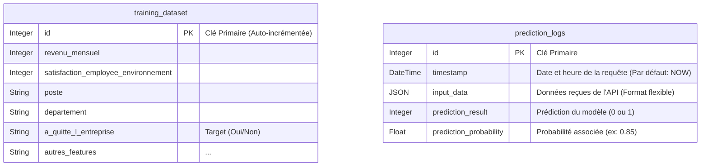

# 🗄️ Architecture de la Base de Données

Pour répondre aux besoins de performance et d'évolution du modèle Machine Learning, nous utilisons une base de données relationnelle **PostgreSQL** (hébergée sur Supabase).

## 1. Schéma de la Base de Données (Diagramme ER)

Le projet repose sur une architecture "Data / MLOps" composée de deux tables indépendantes. Il n'y a volontairement pas de relation (Clé Étrangère) entre elles car elles répondent à des besoins asynchrones différents : le stockage de l'historique d'un côté, et la journalisation en temps réel de l'autre.

## 2. Structure détaillée et Contraintes

### Table `training_dataset` (Historique)
* **Rôle :** Stocker le jeu de données d'origine de manière pérenne et structurée.
* **Volume et Gestion :** L'insertion initiale a été réalisée en un seul bloc via un script d'automatisation Python (`create_db.py`) combinant `pandas` et `SQLAlchemy` pour optimiser l'ingestion des données de test.
* **Contraintes :** Chaque employé historique possède un `id` unique (Primary Key).

### Table `prediction_logs` (Monitoring)
* **Rôle :** Journaliser chaque interaction avec l'API (`/predict`) pour surveiller la dérive du modèle (Data Drift).
* **Conception flexible :** L'utilisation du type `JSON` pour la colonne `input_data` est un choix architectural fort. Il permet d'absorber toute évolution future du schéma d'entrée de l'API (ajout d'une nouvelle feature RH) sans avoir à restructurer la base de données.
* **Contraintes :** La colonne `timestamp` est générée automatiquement à l'insertion pour garantir une traçabilité temporelle absolue.

## 3. Déploiement et Initialisation
La structure entière est versionnée en code (Infrastructure as Code) via le script `create_db.py`. L'ORM **SQLAlchemy** se charge de traduire les classes Python en requêtes SQL sécurisées et de peupler la base avec les exemples initiaux.
